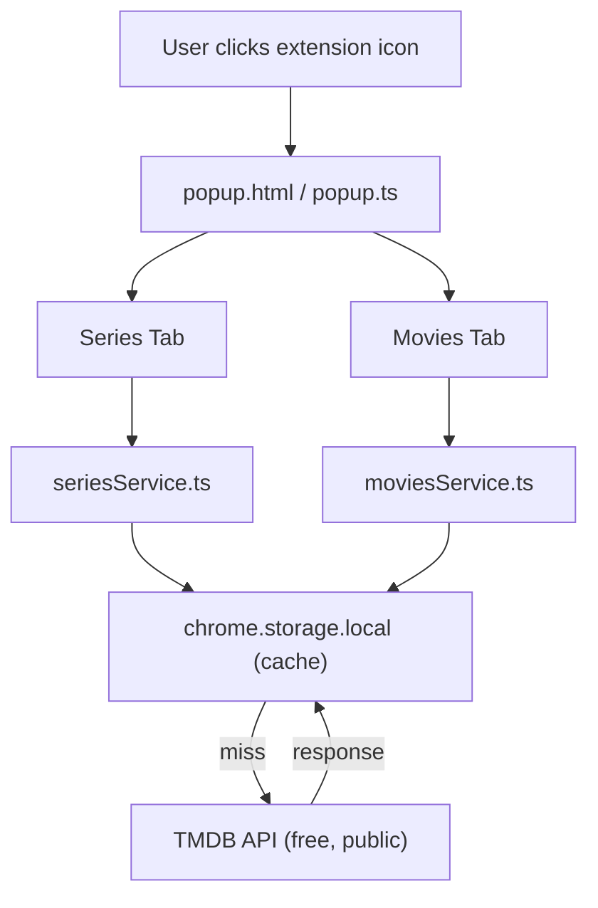
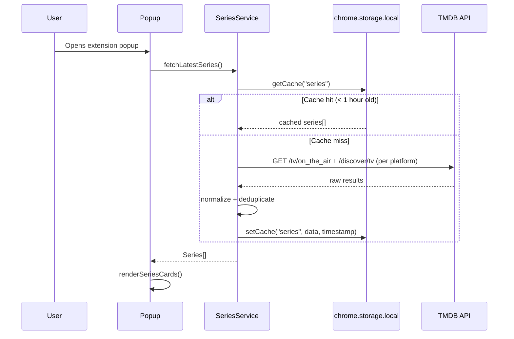
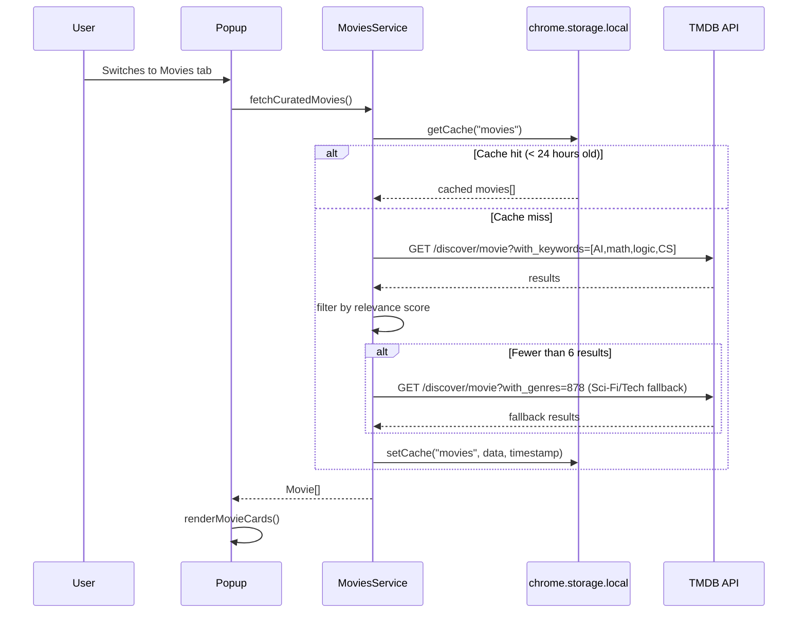

# Design Document: OTT Discovery Extension

## Overview

A Chrome extension (Manifest V3) that surfaces two curated content feeds directly in the browser: the latest TV series across major OTT platforms, and a hand-picked selection of movies that spark curiosity about computer engineering, AI, mathematics, and logic — falling back to tech-news-adjacent films when no new relevant titles exist. All data is fetched client-side from TMDB's free public API with no backend required.

The extension renders a popup UI with two tabs — "Latest Series" and "Curated Movies" — each showing a scrollable card grid with poster, title, platform badge, and a brief description.

### Index

1. [Architecture](#architecture) — Component diagram showing how the popup, services, cache, and TMDB API connect
2. [Sequence Diagrams](#sequence-diagrams) — Step-by-step call flows for loading the Series and Movies tabs
3. [Components and Interfaces](#components-and-interfaces) — What each service does and the TypeScript contracts it exposes
4. [Data Models](#data-models) — Shape of the `Series`, `Movie`, `Platform`, and `CachedEntry` objects
5. [Algorithmic Pseudocode](#algorithmic-pseudocode) — Plain-English logic for `fetchLatestSeries` and `fetchCuratedMovies`, with preconditions and postconditions
6. [Key Functions with Formal Specifications](#key-functions-with-formal-specifications) — Contracts for the core helper functions
7. [Example Usage](#example-usage) — How the popup wires everything together on load
8. [Correctness Properties](#correctness-properties) — Rules the app must never break (used to drive automated tests)
9. [Error Handling](#error-handling) — What happens when the API fails, images are missing, or the cache is corrupt
10. [Testing Strategy](#testing-strategy) — Unit, property-based, and integration testing approach
11. [Performance Considerations](#performance-considerations) — Render time targets and DOM size limits
12. [Security Considerations](#security-considerations) — API key handling and content security policy
13. [Dependencies](#dependencies) — External libraries and APIs used

---

## Architecture



---

## Sequence Diagrams

### Series Tab Load



### Movies Tab Load



---

## Components and Interfaces

### SeriesService

**Purpose**: Fetches and normalizes latest TV series from TMDB, tagged with OTT platform badges.

**Interface**:
```typescript
interface SeriesService {
  fetchLatestSeries(): Promise<Series[]>
}
```

**Responsibilities**:
- Query TMDB `/tv/on_the_air` and `/discover/tv` with `with_watch_providers` filter
- Map TMDB `watch_providers` IDs to platform names (Netflix=8, Prime=9, Disney+=337, Hulu=15, AppleTV+=350, HBO Max=1899)
- Normalize raw TMDB response into `Series[]`
- Read/write cache via `CacheService`

---

### MoviesService

**Purpose**: Fetches curated movies relevant to CS/AI/math/logic, with tech-news fallback.

**Interface**:
```typescript
interface MoviesService {
  fetchCuratedMovies(): Promise<Movie[]>
}
```

**Responsibilities**:
- Query TMDB `/discover/movie` with curated keyword IDs for AI, mathematics, hacking, logic
- Score results by keyword match density
- If result count < 6, fetch fallback set using Sci-Fi genre + "technology" keyword
- Normalize into `Movie[]`
- Read/write cache via `CacheService`

---

### CacheService

**Purpose**: Thin wrapper around `chrome.storage.local` with TTL support.

**Interface**:
```typescript
interface CacheService {
  get<T>(key: string): Promise<CachedEntry<T> | null>
  set<T>(key: string, data: T, ttlMs: number): Promise<void>
}
```

---

### Popup Controller

**Purpose**: Orchestrates tab switching and delegates rendering to card components.

**Responsibilities**:
- Initialize both services on popup open
- Handle tab click events
- Render loading/error/empty states
- Inject cards into DOM

---

## Data Models

### Series

```typescript
interface Series {
  id: number
  title: string
  posterUrl: string        // TMDB image base + poster_path
  overview: string         // truncated to 120 chars
  platforms: Platform[]    // e.g. ["Netflix", "Hulu"]
  firstAirDate: string     // "YYYY-MM-DD"
  rating: number           // TMDB vote_average
}
```

### Movie

```typescript
interface Movie {
  id: number
  title: string
  posterUrl: string
  overview: string         // truncated to 120 chars
  year: number
  rating: number
  relevanceTag: string     // e.g. "AI", "Mathematics", "Hacking", "Tech"
}
```

### Platform

```typescript
type Platform = "Netflix" | "Prime Video" | "Disney+" | "Hulu" | "Apple TV+" | "HBO Max" | "Other"
```

### CachedEntry

```typescript
interface CachedEntry<T> {
  data: T
  timestamp: number        // Date.now() at write time
  ttlMs: number
}
```

---

## Algorithmic Pseudocode

### fetchLatestSeries Algorithm

```pascal
ALGORITHM fetchLatestSeries()
INPUT: none
OUTPUT: series[] of type Series[]

BEGIN
  cached ← CacheService.get("series")
  
  IF cached IS NOT NULL AND (now() - cached.timestamp) < 3600000 THEN
    RETURN cached.data
  END IF

  raw ← TMDB.get("/tv/on_the_air", { watch_region: "US", page: 1 })
  
  series ← []
  FOR each item IN raw.results DO
    providers ← TMDB.get("/tv/{item.id}/watch/providers")
    platforms ← mapProvidersToPlatforms(providers.results.US.flatrate)
    
    IF platforms IS NOT EMPTY THEN
      series.add(normalizeSeries(item, platforms))
    END IF
  END FOR

  series ← deduplicate(series, by: id)
  series ← sortBy(series, by: firstAirDate, order: DESC)
  series ← take(series, 20)

  CacheService.set("series", series, ttl: 3600000)
  RETURN series
END
```

**Preconditions:**
- TMDB API key is set in extension config
- Network is available

**Postconditions:**
- Returns array of 0–20 Series objects
- Each Series has at least one platform
- Result is cached for 1 hour

**Loop Invariants:**
- All added series have valid platform mappings
- No duplicate IDs in accumulator

---

### fetchCuratedMovies Algorithm

```pascal
ALGORITHM fetchCuratedMovies()
INPUT: none
OUTPUT: movies[] of type Movie[]

CONST CURATED_KEYWORDS = [9951, 9871, 10364, 180547]  // AI, hacking, mathematics, logic (TMDB keyword IDs)
CONST FALLBACK_GENRE = 878  // Science Fiction
CONST MIN_RESULTS = 6

BEGIN
  cached ← CacheService.get("movies")
  
  IF cached IS NOT NULL AND (now() - cached.timestamp) < 86400000 THEN
    RETURN cached.data
  END IF

  raw ← TMDB.get("/discover/movie", {
    with_keywords: join(CURATED_KEYWORDS, "|"),
    sort_by: "release_date.desc",
    vote_count_gte: 50
  })

  movies ← map(raw.results, normalizeMovie)
  movies ← scoreAndSort(movies, CURATED_KEYWORDS)

  IF length(movies) < MIN_RESULTS THEN
    fallback ← TMDB.get("/discover/movie", {
      with_genres: FALLBACK_GENRE,
      sort_by: "popularity.desc",
      vote_count_gte: 100
    })
    fallbackMovies ← map(fallback.results, m → normalizeMovie(m, tag: "Tech"))
    movies ← merge(movies, fallbackMovies, limit: 12)
  END IF

  CacheService.set("movies", movies, ttl: 86400000)
  RETURN movies
END
```

**Preconditions:**
- TMDB API key available
- `CURATED_KEYWORDS` contains valid TMDB keyword IDs

**Postconditions:**
- Returns 6–12 Movie objects
- Each movie has a `relevanceTag`
- Fallback only triggered when primary results < 6
- Cached for 24 hours

---

## Key Functions with Formal Specifications

### mapProvidersToPlatforms()

```typescript
function mapProvidersToPlatforms(flatrate: TMDBProvider[]): Platform[]
```

**Preconditions:**
- `flatrate` is an array (may be empty)
- Each provider has a `provider_id: number`

**Postconditions:**
- Returns only known Platform values
- Unknown provider IDs are silently dropped
- No duplicates in result

---

### normalizeSeries()

```typescript
function normalizeSeries(raw: TMDBTVResult, platforms: Platform[]): Series
```

**Preconditions:**
- `raw.id`, `raw.name`, `raw.first_air_date` are present
- `platforms` is non-empty

**Postconditions:**
- `overview` is truncated to ≤ 120 characters
- `posterUrl` is a valid absolute URL or empty string
- `rating` is in range [0, 10]

---

### scoreAndSort()

```typescript
function scoreAndSort(movies: Movie[], keywords: number[]): Movie[]
```

**Preconditions:**
- `movies` is a valid array
- `keywords` is non-empty

**Postconditions:**
- Returns movies sorted by keyword match count descending
- Movies with 0 keyword matches are placed last
- Input array is not mutated

---

## Example Usage

```typescript
// popup.ts — on DOMContentLoaded
const seriesService = new SeriesService(TMDB_API_KEY)
const moviesService = new MoviesService(TMDB_API_KEY)

document.getElementById("tab-series")?.addEventListener("click", async () => {
  showLoading()
  const series = await seriesService.fetchLatestSeries()
  renderCards(series, "series-grid")
})

document.getElementById("tab-movies")?.addEventListener("click", async () => {
  showLoading()
  const movies = await moviesService.fetchCuratedMovies()
  renderCards(movies, "movies-grid")
})

// Auto-load series tab on open
seriesService.fetchLatestSeries().then(series => renderCards(series, "series-grid"))
```

---

## Correctness Properties

- For all Series `s` returned: `s.platforms.length >= 1`
- For all Movie `m` returned: `m.relevanceTag` is one of `["AI", "Mathematics", "Hacking", "Logic", "Tech"]`
- Cache TTL for series is exactly 1 hour (3,600,000 ms); for movies, 24 hours (86,400,000 ms)
- If TMDB returns an error, the service returns an empty array (no crash)
- The fallback movie query is triggered if and only if primary results count < 6
- No API call is made if a valid (non-expired) cache entry exists

---

## Error Handling

### TMDB API Failure

**Condition**: Network error or non-200 response from TMDB  
**Response**: Catch error, log to console, return `[]`  
**Recovery**: Next popup open retries (no stale cache served on error)

### Missing Poster Image

**Condition**: `poster_path` is null in TMDB response  
**Response**: Use a placeholder image URL  
**Recovery**: Graceful degradation — card still renders

### Empty Results

**Condition**: TMDB returns 0 results for both primary and fallback queries  
**Response**: Render an empty state message: "Nothing found right now — check back later"  
**Recovery**: Cache is not written; next open retries

### Expired/Corrupt Cache

**Condition**: `chrome.storage.local` returns malformed data  
**Response**: Treat as cache miss, fetch fresh data  
**Recovery**: Overwrite with fresh valid data

---

## Testing Strategy

### Unit Testing Approach

Test each service in isolation with mocked TMDB responses:
- `normalizeSeries()` with complete and partial TMDB payloads
- `mapProvidersToPlatforms()` with known and unknown provider IDs
- `scoreAndSort()` with various keyword match counts
- `CacheService.get()` with expired, valid, and missing entries

### Property-Based Testing Approach

**Property Test Library**: fast-check

- For any TMDB TV response array, `fetchLatestSeries()` never returns duplicates
- For any movie array with < 6 items, fallback is always triggered
- `normalizeSeries()` always produces `overview.length <= 120`
- `mapProvidersToPlatforms()` never returns unknown platform strings

### Integration Testing Approach

- Mock `chrome.storage.local` and verify cache read/write round-trips
- Verify popup tab switching triggers correct service calls

---

## Performance Considerations

- Popup must render within 300ms for cached data (no network call)
- TMDB images loaded lazily (`loading="lazy"` on `` tags)
- Maximum 20 series cards and 12 movie cards to keep DOM small
- Per-provider `/watch/providers` calls are batched only for the top 20 results

---

## Security Considerations

- TMDB API key stored in `manifest.json` as a build-time constant (acceptable for free public API)
- `Content-Security-Policy` in manifest restricts script sources to `'self'`
- No user data collected or transmitted
- All external requests go only to `api.themoviedb.org` and `image.tmdb.org`

---

## Dependencies

| Dependency | Purpose |
|---|---|
| TMDB API (free) | TV series, movie metadata, watch providers, images |
| Chrome Extension APIs | `chrome.storage.local` for caching |
| Manifest V3 | Extension platform |
| TypeScript | Type-safe implementation |
| Vite or esbuild | Build tooling for extension bundle |
