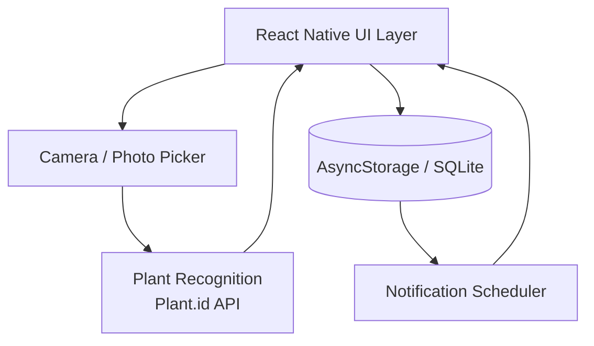
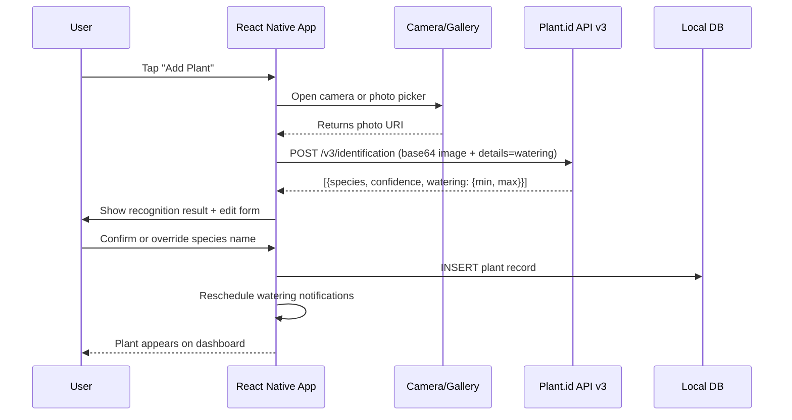
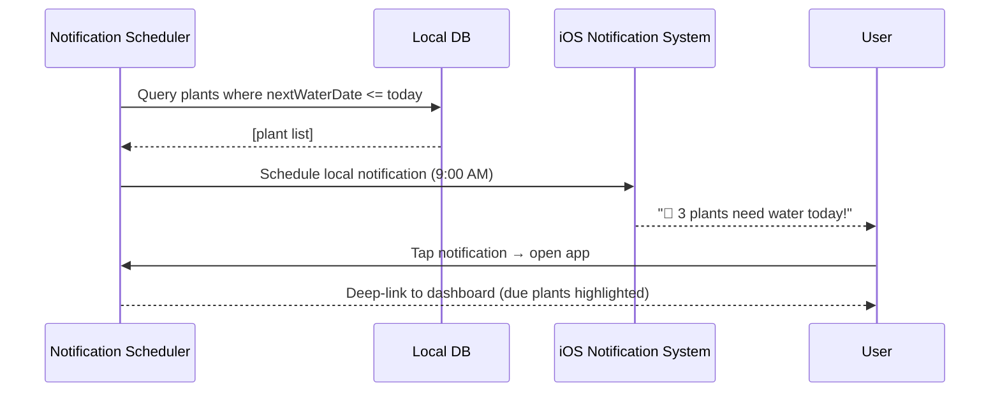
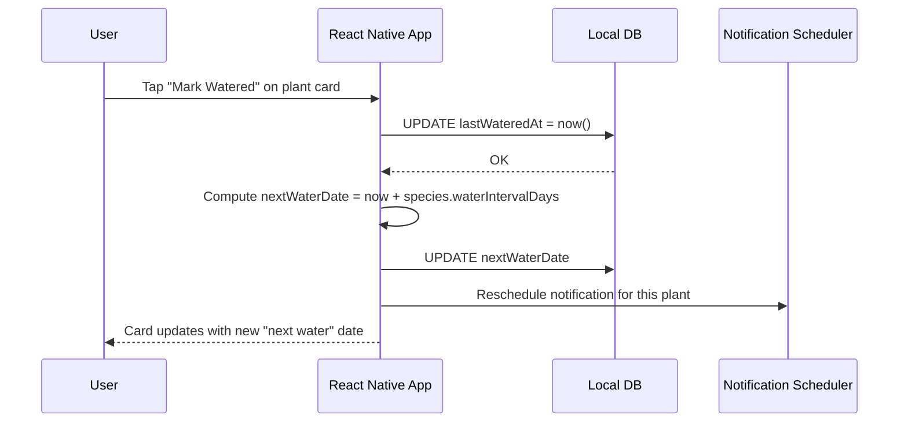

# Design Document: Plant Watering Tracker

## Overview

A React Native iOS app (MVP) that lets users photograph their houseplants, automatically identifies the species via an AI vision API, and delivers daily push notifications reminding them which plants need watering or spraying. A friendly dashboard gives a quick health-at-a-glance view of every plant in the home.

The app is intentionally scoped as an MVP: local on-device storage (no backend required), a single free-tier AI vision integration, and a playful UI suitable as a gift app. All core flows work offline except species recognition.

---

## Architecture



### Key Architectural Decisions

| Decision | Choice | Rationale |
|---|---|---|
| Platform | React Native (Expo) | Cross-platform TypeScript, fastest path to iOS App Store |
| Storage | Expo SQLite (local) | No backend needed for MVP; fast offline reads |
| Species AI | Plant.id API v3 (free tier) | Dedicated plant recognition with botanical watering preference data from MOBOT & RHS |
| Notifications | Expo Notifications | Handles iOS permission flow + scheduling out of the box |
| Images | Expo FileSystem (local cache) | Avoid upload costs; images stored on-device |

---

## Sequence Diagrams

### Add Plant Flow



### Daily Notification Flow



### Mark Watered Flow



---

## Components and Interfaces

### Component 1: PlantRepository

**Purpose**: All CRUD operations against local SQLite storage.

**Interface**:
```typescript
interface PlantRepository {
  getAllPlants(): Promise<Plant[]>
  getPlantById(id: string): Promise<Plant | null>
  insertPlant(plant: NewPlant): Promise<Plant>
  updatePlant(id: string, updates: Partial<Plant>): Promise<Plant>
  deletePlant(id: string): Promise<void>
  getPlantsNeedingWaterToday(): Promise<Plant[]>
}
```

**Responsibilities**:
- Manage SQLite schema migrations
- Return typed `Plant` objects
- Compute `nextWaterDate` on insert/update

---

### Component 2: SpeciesRecognitionService

**Purpose**: Send a photo to Plant.id API v3 and return ranked species suggestions with watering frequency derived from botanical data.

**Interface**:
```typescript
interface SpeciesRecognitionService {
  identifyFromUri(photoUri: string): Promise<SpeciesSuggestion[]>
}

interface SpeciesSuggestion {
  commonName: string
  scientificName: string
  confidence: number          // 0–1
  wateringPreference: { min: number, max: number }  // Plant.id scale 1–3
  waterIntervalDays: number   // derived from wateringPreference (see mapping below)
  careNotes: string
}
```

**Watering Preference → Interval Mapping**:

Plant.id returns a `watering` field with `min` and `max` on a 1–3 scale (sourced from MOBOT & RHS):

| Plant.id `max` value | Moisture preference | Default `waterIntervalDays` |
|---|---|---|
| 1 | Dry | 14 days |
| 2 | Medium | 7 days |
| 3 | Wet | 3 days |

The `max` value is used for the mapping. User can always override the derived interval manually.

**Responsibilities**:
- Compress image to ≤ 1MB before upload
- Call `POST /v3/identification` with `details=watering,common_names` in request body
- Map `watering.max` to `waterIntervalDays` using the table above
- Handle API errors gracefully (return empty array; user can type manually)
- Cache recognition results keyed by image hash (avoid duplicate calls)

---

### Component 3: NotificationScheduler

**Purpose**: Manage daily local push notifications for watering reminders.

**Interface**:
```typescript
interface NotificationScheduler {
  requestPermissions(): Promise<boolean>
  rescheduleAll(plants: Plant[]): Promise<void>
  cancelForPlant(plantId: string): Promise<void>
}
```

**Responsibilities**:
- Cancel and recreate all scheduled notifications when plant data changes
- Group multiple due plants into a single notification message
- Trigger at 9:00 AM local time daily

---

### Component 4: DashboardScreen

**Purpose**: Main home screen — overview of all plants with quick actions.

**Responsibilities**:
- Render `PlantCard` list sorted by urgency (overdue → due today → upcoming)
- Show summary stats row (total plants, due today count)
- Fun animated element (wiggling plant emoji or Lottie animation when all plants are watered)

---

## Data Models

### Plant

```typescript
interface Plant {
  id: string                  // UUID v4
  nickname: string            // user-editable display name
  speciesCommonName: string
  speciesScientificName: string
  photoUri: string            // local file path
  addedAt: string             // ISO 8601
  birthDate: string | null    // ISO 8601, user-supplied for "age" display
  lastWateredAt: string | null
  lastSprayedAt: string | null
  waterIntervalDays: number   // days between waterings
  sprayIntervalDays: number | null
  nextWaterDate: string       // derived, stored for fast querying
  notes: string
}
```

**Validation Rules**:
- `waterIntervalDays` must be ≥ 1
- `photoUri` must point to a valid local file
- `nickname` must be non-empty (fallback to `speciesCommonName`)

### NewPlant (creation payload)

```typescript
type NewPlant = Omit<Plant, 'id' | 'nextWaterDate' | 'addedAt'>
```

### AppSettings

```typescript
interface AppSettings {
  notificationTime: string    // "HH:MM" 24h format, default "09:00"
  notificationsEnabled: boolean
}
```

---

## Algorithmic Pseudocode

### Main: Add Plant Algorithm

```pascal
ALGORITHM addPlant(photoUri, userOverrides)
INPUT:  photoUri: string, userOverrides: Partial<NewPlant>
OUTPUT: plant: Plant

BEGIN
  ASSERT photoUri IS NOT NULL

  // Step 1: Recognize species
  compressed ← compressImage(photoUri, maxSizeKB: 1024)
  suggestions ← SpeciesRecognitionService.identifyFromUri(compressed)

  IF suggestions IS EMPTY THEN
    // Graceful degradation — user types manually
    suggestion ← DEFAULT_SUGGESTION
  ELSE
    suggestion ← suggestions[0]
  END IF

  // Step 2: Merge with user overrides
  FOR each field IN userOverrides DO
    suggestion[field] ← userOverrides[field]
  END FOR

  // Step 3: Compute derived fields
  now ← currentISODate()
  nextWaterDate ← addDays(now, suggestion.waterIntervalDays)

  // Step 4: Persist
  plant ← PlantRepository.insertPlant({
    ...suggestion,
    photoUri: photoUri,
    addedAt: now,
    nextWaterDate: nextWaterDate,
    lastWateredAt: null
  })

  // Step 5: Reschedule notifications
  all ← PlantRepository.getAllPlants()
  NotificationScheduler.rescheduleAll(all)

  ASSERT plant.id IS NOT NULL
  ASSERT plant.nextWaterDate >= now

  RETURN plant
END
```

**Preconditions**:
- `photoUri` refers to a readable local file
- Device has storage write permission

**Postconditions**:
- Plant record exists in local DB with valid `id`
- `nextWaterDate` is set to `now + waterIntervalDays`
- Notification scheduler has been updated

---

### Mark Plant Watered Algorithm

```pascal
ALGORITHM markWatered(plantId, actionType)
INPUT:  plantId: string, actionType: "water" | "spray"
OUTPUT: updatedPlant: Plant

BEGIN
  plant ← PlantRepository.getPlantById(plantId)
  ASSERT plant IS NOT NULL

  now ← currentISODate()

  IF actionType = "water" THEN
    updates.lastWateredAt ← now
    updates.nextWaterDate ← addDays(now, plant.waterIntervalDays)
  ELSE IF actionType = "spray" THEN
    updates.lastSprayedAt ← now
  END IF

  updatedPlant ← PlantRepository.updatePlant(plantId, updates)

  // Reschedule only this plant's notification
  all ← PlantRepository.getAllPlants()
  NotificationScheduler.rescheduleAll(all)

  ASSERT updatedPlant.lastWateredAt = now  // when actionType = "water"
  RETURN updatedPlant
END
```

**Preconditions**:
- `plantId` corresponds to an existing plant

**Postconditions**:
- `lastWateredAt` or `lastSprayedAt` updated to current timestamp
- `nextWaterDate` advanced by `waterIntervalDays`

**Loop Invariants**: N/A (no loops)

---

### Notification Reschedule Algorithm

```pascal
ALGORITHM rescheduleAll(plants)
INPUT:  plants: Plant[]
OUTPUT: void

BEGIN
  // Cancel all existing scheduled notifications
  FOR each scheduled IN iOS.getAllScheduledNotifications() DO
    iOS.cancelNotification(scheduled.id)
  END FOR

  // Group plants by nextWaterDate
  grouped ← GROUP plants BY plant.nextWaterDate

  FOR each date IN grouped.keys DO
    duePlants ← grouped[date]

    IF date <= addDays(today(), 7) THEN
      // Only schedule notifications within the next 7 days
      message ← buildNotificationMessage(duePlants)
      iOS.scheduleLocalNotification({
        title: "🌿 Time to water!",
        body: message,
        trigger: { date: date, hour: 9, minute: 0 }
      })
    END IF

    ASSERT each duePlant IN duePlants HAS nextWaterDate = date
  END FOR
END
```

**Preconditions**:
- Notification permissions have been granted

**Postconditions**:
- All previous notifications cancelled
- New notifications scheduled for each unique `nextWaterDate` within 7 days
- At most one notification per calendar day

**Loop Invariants**:
- All previously processed dates have had their notification scheduled

---

## Key Functions with Formal Specifications

### `computePlantAge(birthDate: string | null): string`

**Preconditions**:
- `birthDate` is null or a valid ISO 8601 date string

**Postconditions**:
- Returns human-readable string e.g. `"2 years, 3 months"` or `"Unknown"` when null
- Never throws

---

### `compressImage(uri: string, maxSizeKB: number): Promise<string>`

**Preconditions**:
- `uri` is a valid local file path
- `maxSizeKB` > 0

**Postconditions**:
- Returns URI of compressed image ≤ `maxSizeKB` in size
- Original file is unchanged
- Output format is JPEG

---

### `buildNotificationMessage(plants: Plant[]): string`

**Preconditions**:
- `plants.length >= 1`

**Postconditions**:
- Returns non-empty string
- If `plants.length === 1`: `"Your {nickname} needs water today"`
- If `plants.length > 1`: `"{n} plants need water today"`

---

## Example Usage

```typescript
// 1. Add a plant from camera roll
const suggestions = await speciesService.identifyFromUri(photoUri)
const plant = await addPlant(photoUri, {
  nickname: "My Monstera",
  speciesCommonName: suggestions[0]?.commonName ?? "Unknown",
  waterIntervalDays: suggestions[0]?.waterIntervalDays ?? 7,
})

// 2. Mark as watered from dashboard card
await markWatered(plant.id, "water")

// 3. Fetch today's due plants for notification preview
const duePlants = await plantRepo.getPlantsNeedingWaterToday()
// → [{ id: "abc", nickname: "My Monstera", nextWaterDate: "2024-01-15", ... }]

// 4. Compute display age
const age = computePlantAge("2022-03-01")
// → "2 years, 10 months"
```

---

## Correctness Properties

- For all plants `p`: `p.nextWaterDate = addDays(p.lastWateredAt ?? p.addedAt, p.waterIntervalDays)`
- For all mark-watered calls: after `markWatered(id, "water")`, the plant's `nextWaterDate > today()`
- For all notification schedules: at most one notification is scheduled per calendar day
- For all species recognition calls: if API fails, the app remains usable (empty suggestion list returned, no crash)
- For all plant cards: `lastWateredAt` display is never in the future

---

## Error Handling

### Species Recognition Failure

**Condition**: Plant.id API returns an error, times out, or `watering` field is null
**Response**: Show inline message "Couldn't identify — enter species manually". Pre-fill form with empty fields; default `waterIntervalDays = 7`.
**Recovery**: User types species name and adjusts interval manually

### Notification Permission Denied

**Condition**: User denies iOS notification permission  
**Response**: Onboarding screen explains why notifications are helpful; offer "Remind me later"  
**Recovery**: Settings screen has "Enable Notifications" button that re-prompts

### Photo Read Failure

**Condition**: Selected photo URI becomes invalid (e.g. deleted from Photos)  
**Response**: Show placeholder image; toast "Photo unavailable"  
**Recovery**: User can re-upload from plant edit screen

### Storage Full

**Condition**: SQLite write fails  
**Response**: Show error toast "Couldn't save plant — storage may be full"  
**Recovery**: No silent data loss; user is informed

---

## Testing Strategy

### Unit Testing Approach

- Test `computePlantAge`, `buildNotificationMessage`, `compressImage` in isolation
- Mock `PlantRepository` for `addPlant` and `markWatered` logic tests
- Test date arithmetic edge cases: watered on Feb 28, leap years

### Property-Based Testing Approach

**Property Test Library**: fast-check

Key properties:
- For any valid plant, `nextWaterDate` is always in the future after `markWatered`
- For any list of plants, `rescheduleAll` produces at most one notification per calendar day
- `buildNotificationMessage` never returns an empty string for non-empty plant lists
- `computePlantAge` never throws for any string input

### Integration Testing Approach

- Test full `addPlant` flow with a mocked Plant.id API response
- Test notification scheduling against Expo Notifications mock

---

## Performance Considerations

- Image compression to ≤ 1MB before any API call keeps network fast on cellular
- SQLite queries for dashboard use indexed `nextWaterDate` column for O(log n) lookup
- Plant list is expected to stay < 100 items for a household — no pagination needed for MVP
- Notification reschedule is a full-cancel-and-recreate; acceptable at < 100 plants

---

## Security Considerations

- Plant.id API key stored in `.env` and excluded from version control; bundled via Expo's `Constants.expoConfig.extra`
- No user accounts or cloud sync in MVP — no PII transmitted except plant photos sent to Plant.id for recognition
- Photos sent to Plant.id should be disclosed in the app's privacy note during onboarding

---

## Dependencies

| Package | Purpose |
|---|---|
| `expo` | React Native toolchain for iOS |
| `expo-camera` / `expo-image-picker` | Camera and gallery access |
| `expo-sqlite` | Local persistent storage |
| `expo-notifications` | iOS local push notifications |
| `expo-file-system` | Local image caching and compression |
| `expo-image-manipulator` | Image resize/compress before API upload |
| `react-navigation` | Screen navigation |
| `lottie-react-native` | Fun animated dashboard element |
| `Plant.id API v3` | Plant species recognition with botanical watering preference data (plant.id) |

---

## UI Wireframes

### Screen 1 — Dashboard (Home)

```
┌─────────────────────────┐
│  🌿 My Plant Garden     │
│                         │
│  ┌──────┬──────┬──────┐ │
│  │  6   │  3   │  2   │ │
│  │Plants│Today │Overdue│ │
│  └──────┴──────┴──────┘ │
│                         │
│  ⚠️  DUE TODAY          │
│  ┌───────────────────┐  │
│  │ 🪴  Monstera      │  │
│  │ Last: 7 days ago  │  │
│  │ Age: 2 yrs        │  │
│  │ [💧 Water][🌫 Spray] │
│  └───────────────────┘  │
│  ┌───────────────────┐  │
│  │ 🌺  Orchid        │  │
│  │ Last: 3 days ago  │  │
│  │ Age: 8 months     │  │
│  │ [💧 Water]        │  │
│  └───────────────────┘  │
│                         │
│  ✅  ALL OTHERS OK      │
│  ┌────────┐ ┌────────┐  │
│  │🌵Cactus│ │🎋Bamboo│  │
│  │ in 5d  │ │ in 2d  │  │
│  └────────┘ └────────┘  │
│                         │
│  🎉 (confetti animation │
│     when all done)      │
│                         │
│       [+ Add Plant]     │
└─────────────────────────┘
```

---

### Screen 2 — Add Plant (Camera + Recognition)

```
┌─────────────────────────┐
│  ←  Add a Plant         │
│                         │
│  ┌─────────────────────┐│
│  │                     ││
│  │     [ 📷 Photo ]    ││
│  │                     ││
│  │   or tap to upload  ││
│  └─────────────────────┘│
│                         │
│  🔍 Identifying...      │
│  ▓▓▓▓▓▓▓░░░  70%       │
│                         │
│  ── Result ──────────── │
│  Monstera Deliciosa     │
│  Swiss Cheese Plant     │
│  Confidence: 94%        │
│                         │
│  [ ✏️  Edit / Override ]│
│                         │
│  Water every  [  7  ] days
│  Spray?       [ ✓ Yes ] │
│  Nickname  [My Monstera]│
│  Birth date  [Jan 2022] │
│                         │
│  [      Save Plant    ] │
└─────────────────────────┘
```

---

### Screen 3 — Plant Detail / Edit

```
┌─────────────────────────┐
│  ←  Monstera            │
│                         │
│  ┌─────────────────────┐│
│  │    [ plant photo ]  ││
│  └─────────────────────┘│
│                         │
│  Nickname  [My Monstera ]│
│  Species   [Monstera    ]│
│            [Deliciosa   ]│
│  Age       [2 yrs 3 mo  ]│
│  Water every [ 7  ] days │
│  Spray every [ 14 ] days │
│                         │
│  ── History ──────────  │
│  💧 Last watered: Today  │
│  🌫 Last sprayed: 5d ago │
│  📅 Next water:  Apr 23  │
│                         │
│  [    Save Changes    ] │
│  [    Delete Plant    ] │
└─────────────────────────┘
```

---

### Screen 4 — Daily Reminder → Deep Link

```
 ┌─────────────────────────┐
 │ 🔔  9:00 AM             │
 │ ┌───────────────────┐   │
 │ │ 🌿 Plant Tracker  │   │
 │ │ 3 plants need     │   │
 │ │ water today!      │   │
 │ └───────────────────┘   │
 └─────────────────────────┘

           ↓ tap

┌─────────────────────────┐
│  💧 Today's Watering    │
│                         │
│  ┌───────────────────┐  │
│  │ 🪴 Monstera  [✓]  │  │
│  └───────────────────┘  │
│  ┌───────────────────┐  │
│  │ 🌺 Orchid    [✓]  │  │
│  └───────────────────┘  │
│  ┌───────────────────┐  │
│  │ 🎋 Bamboo    [ ]  │  │
│  └───────────────────┘  │
│                         │
│  [  Mark All Done 💧  ] │
└─────────────────────────┘
```

---

## Deployment

### Chosen Approach: TestFlight via EAS Build

The app will be distributed to the recipient via Apple TestFlight — no Mac or Xcode required on the developer's side thanks to Expo's cloud build service (EAS Build).

### Deployment Steps

```
1. eas build --platform ios
       ↓ (Expo builds in the cloud, ~10 min)
2. Download .ipa from expo.dev
       ↓
3. Upload to App Store Connect
       ↓
4. Add recipient as TestFlight tester (by Apple ID / email)
       ↓
5. Recipient installs TestFlight app from App Store
       ↓
6. Recipient accepts invite → installs the app
```

### Prerequisites Checklist

| Item | Cost | Notes |
|---|---|---|
| Apple Developer account | $99/year | Required for TestFlight |
| Expo / EAS account | Free | expo.dev — handles cloud builds |
| Plant.id API key | Free | plant.id — for species recognition + watering data |
| Node.js installed | Free | v18+ recommended |
| Recipient's Apple ID | Free | To send TestFlight invite |

### App Update Flow

Any future update follows the same path — `eas build` → upload → TestFlight automatically notifies the recipient of the update.
